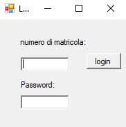
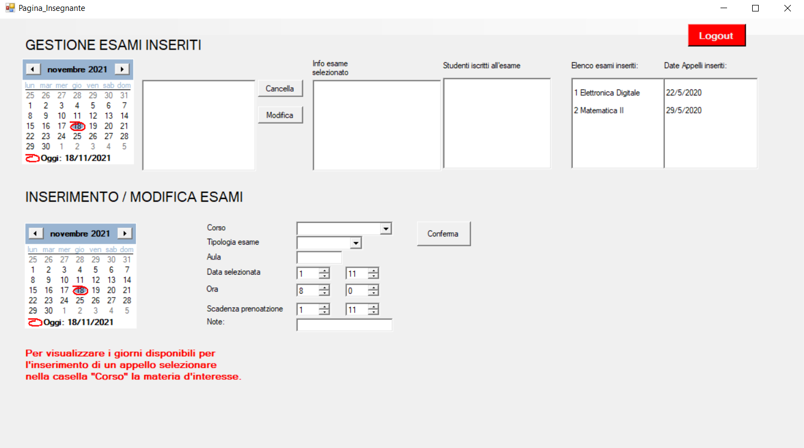
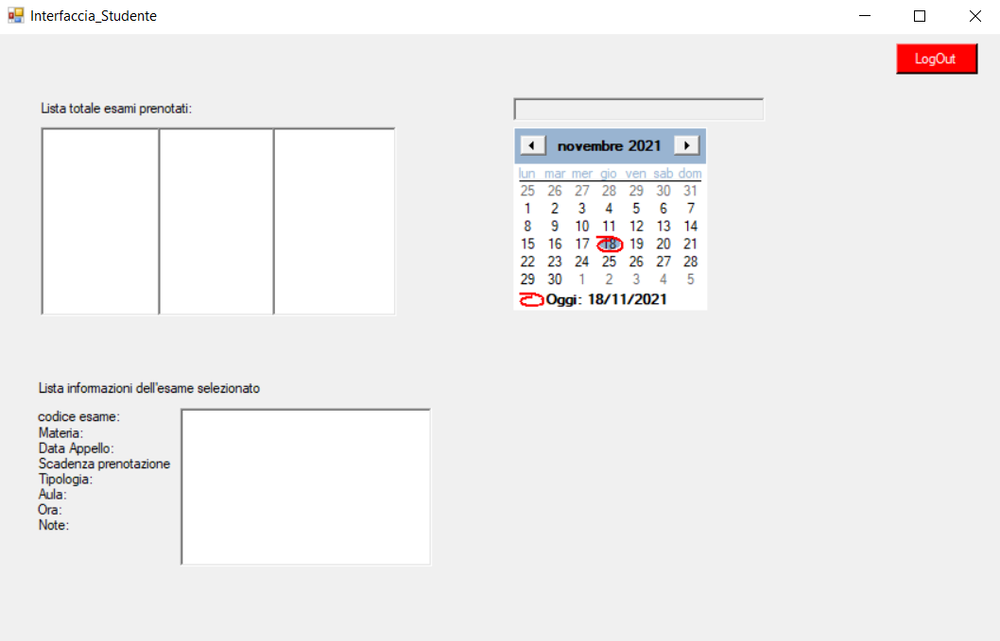

<b><h1>Booking Interface</h1></b>

Project in collaboration wit Marianna Cossu for HUMAN COMPUTER INTERACT exam

<b><h2>Targets</h2></b>

The aim of this project is to implement several interfaces for booking exams in a university.

The project was realised with Visual Studio windows forms and written in C#.

<b><h2>Introduction</h2></b>

The project is divided as follows: 

-   *Login Interface*: This interface allows do the login 

- 
-   *Teacher Interface*:  Here you can add or delate an exam, with the carresponding information

-   *Student Interface*: The student interface allows you to book or cancel exams that have been entered on the calendar by the various professors.

***File management***

The following files are located in this folder:
-   *INSEGNATI.txt*: Contains information about all teachers who can add or remove exams.
-   *STUDENTI.txt*: Contains information about all students, who can book or cancel.
-   *MATERIE.txt*: Subjects with teachers 
-   *PRENOTAZIONI.txt*: Bookings made by students 
-   *ESAMI.txt*: Exams added by professors 